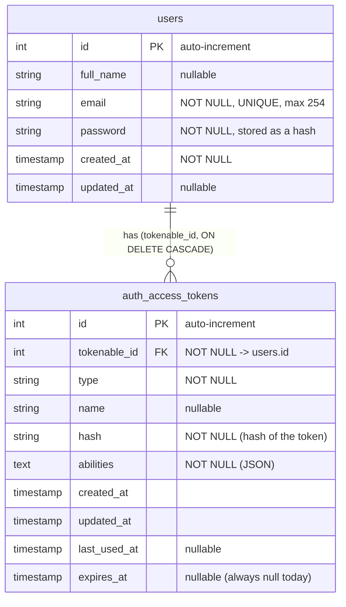

# FlowSync — Current capabilities and data model

Snapshot of what the app does today, from the code on `s2/start`. The product is meant to be team task management, but **only user accounts and authentication exist so far**. There are no tasks, projects or teams yet.

## 1. Capabilities

### What a user can do

| Capability | Frontend screen | Backend endpoint |
|---|---|---|
| Create an account (optional full name, email, password + confirmation) and get logged in right away | `/register` | `POST /api/v1/auth/signup` |
| Log in with email and password | `/login` | `POST /api/v1/auth/login` |
| See their own profile: initials avatar, name (or "Sin nombre"), email, and "Miembro desde" date | `/profile` | `GET /api/v1/account/profile` |
| Log out, which revokes the current token on the server | `/profile` (button) | `POST /api/v1/account/logout` |
| Stay logged in after a page reload | — (runs on app start) | `GET /api/v1/account/profile` |

There is also `GET /` → `{ "hello": "world" }`.

### Backend API (`backend/`, AdonisJS 7)

| Method | Route | Auth | Request body | Response (`data` wrapper) |
|---|---|---|---|---|
| POST | `/api/v1/auth/signup` | no | `{ fullName: string \| null, email, password, passwordConfirmation }` | `{ user, token }` |
| POST | `/api/v1/auth/login` | no | `{ email, password }` | `{ user, token }` |
| GET | `/api/v1/account/profile` | Bearer | — | `user` |
| POST | `/api/v1/account/logout` | Bearer | — | `{ message: "Logged out successfully" }` (no `data` wrapper, returned directly) |

`user` is the output of `UserTransformer`: `{ id, fullName, email, createdAt, updatedAt, initials }`. The password is never serialized.

**Validation rules** (`app/validators/user.ts`, VineJS):

- `email`: valid email, max 254 characters, must be unique in `users.email` on signup.
- `password`: 8–32 characters on signup; `passwordConfirmation` must match it. On login the password only has to be a string.
- `fullName`: string or `null`. The key must always be sent.

Before VineJS runs, the body parser (`config/bodyparser.ts`: `trimWhitespaces`, `convertEmptyStringsToNull`) trims every string and turns empty strings into `null`. So a password of only spaces fails as `required`, not `minLength`. A `fullName` of only spaces is saved as `null`.

**Error responses:**

- `422` — validation errors, as `{ errors: [{ message, rule, field, meta }] }`.
- `400` — wrong email or password (`E_INVALID_CREDENTIALS`).
- `401` — missing, invalid or revoked token on protected routes.

**Authentication:**

- The default guard is `api`, which uses opaque access tokens stored hashed in `auth_access_tokens`. A `web` session guard is configured but not used.
- Tokens are created on signup and on login. They have **no expiry** (`DbAccessTokensProvider.forModel(User)` is used without `expiresIn`) and the only way to revoke one is logout.
- `silent_auth_middleware` runs on every route. Protection is applied per group with `middleware.auth()`.
- `force_json_response_middleware` makes every response JSON.

### Frontend (`frontend/`, React 19 + Vite 8)

- **Routes** (`src/routes/app-routes.tsx`):
  - `/login` and `/register` are public-only: a logged-in user is redirected away.
  - `/profile` is protected: a user who is not logged in is sent to `/login`.
  - Any other path redirects to `/profile`. For a user who is not logged in, that means a second redirect to `/login`.
- **Session** (`src/auth/auth-provider.tsx`):
  - The token is stored in `localStorage` under `flowsync.token`.
  - On app start the token is checked with `GET /account/profile`. It is thrown away if that call returns 401.
  - Logout clears the local session even if the server call fails.
- **API layer** (`src/lib/api.ts`):
  - It is the only module that calls the backend.
  - It removes the `{ data }` wrapper and adds the `Bearer` header.
  - It turns backend errors into `ApiError`, with a Spanish message and a `fieldErrors` map that forms show under each input.
- **UI:** Tailwind v4 + shadcn/ui components (`alert`, `button`, `card`, `input`, `label`).

### Not built yet

- Tasks, projects, teams or membership. None of these have a table, model or endpoint.
- Editing the profile, changing the password, recovering a password, or verifying an email.
- Roles or permissions of any kind beyond "logged in or not".
- Tests: the Japa `unit` and `functional` suites are declared, but there are no spec files. The frontend has no test runner.

## 2. Data model

SQLite database at `backend/tmp/db.sqlite3`. It is created by two migrations in `backend/database/migrations/`. The Lucid schema classes in `database/schema.ts` are generated from those migrations.

### `users` → model `User` (`app/models/user.ts`)

| Column | Type | Constraints | Model property |
|---|---|---|---|
| `id` | integer | PK, auto-increment | `id` |
| `full_name` | string | nullable | `fullName` |
| `email` | string(254) | not null, unique | `email` |
| `password` | string | not null; hashed by the `withAuthFinder(hash)` mixin; `serializeAs: null` | `password` |
| `created_at` | timestamp | not null, set automatically on create | `createdAt` |
| `updated_at` | timestamp | nullable, set automatically on create and update | `updatedAt` |

What the model adds on top of the columns:

- `withAuthFinder(hash)`: provides `User.verifyCredentials(email, password)` and hashes the password when it is saved.
- `static accessTokens = DbAccessTokensProvider.forModel(User)`: manages the user's tokens.
- `currentAccessToken`: the token used for the current request. Logout uses it to revoke that token.
- `initials` getter, which the API also returns:
  - If there is a full name, it takes the first letter of the first two words.
  - If there is no full name, it splits the email at `@` and takes the first letter of each part.
  - If only one part exists (for example, a one-word name), it takes the first two letters of that part.
  - The result is uppercased.

### `auth_access_tokens` (no model of its own)

Managed only by `DbAccessTokensProvider`. Each row belongs to one user through `tokenable_id`, and all of a user's rows are deleted when the user is deleted. Only a hash of the token is stored. The plain value is returned once, on signup or login.

### Relationships

- **One `User` has many access tokens.** This is the only relationship.
- There are no Lucid relationships (`hasMany`, `belongsTo`, …) declared on any model yet.
